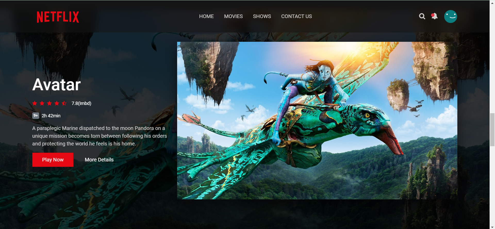

# Netflix-Inspired Landing Page

This is a sample landing page inspired by Netflix's homepage. It showcases modern web design techniques and demonstrates responsive layouts, attractive visuals, and basic interactivity.

## Features
- **Responsive Design**: Optimized for various screen sizes, including mobile, tablet, and desktop.
- **Modern CSS Styling**: Eye-catching hover effects, gradients, and a Netflix-style content layout.
- **JavaScript Interactivity**: Smooth scrolling navigation and dynamic elements.

## Technologies Used
- **HTML5**: For structuring the webpage.
- **CSS3**: For styling and animations.
- **JavaScript**: For adding interactivity.

##Preview

### **Features Section**


### **Trending Section**


### **Top Picks**


### **Recommended**


### **Special**


### **Trailers**
	

> **Note**: Ensure that all images are saved in the folder `assets/images/` within your project directory, and that the file paths in the Markdown match their actual locations.

## How to Run
To view the landing page locally:
1. Clone this repository to your computer:
   ```bash
   git clone <https://github.com/Ajeeetsingh/Netflix-Landing-page/tree/main>
